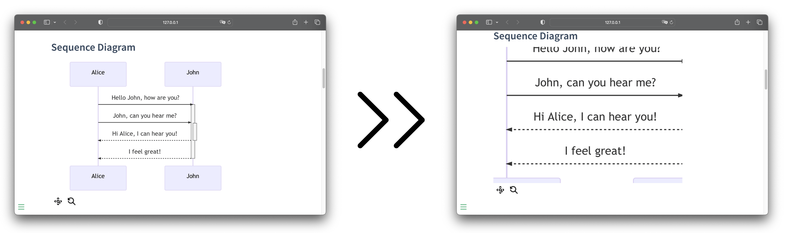

# Docsify-mermaid-zoom

A simple Docsify plugin enabling zoom in mermaid diagrams.



👉 You can test the plugin [here](https://corentinleberre.github.io/docsify-mermaid-zoom/)

## How to use

### Dependencies

- [mermaid-docsify](https://github.com/Leward/mermaid-docsify/])
- [D3.js](https://d3js.org)

Add the dependencies and plugin to `index.html`

```html
<script>
  window.$docsify = {
    ...,
    mermaidConfig: {
      querySelector: ".mermaid",
    }
    ...,
  };
</script>
<!-- Import D3.js -->
<script src="//cdn.jsdelivr.net/npm/d3@7"></script>
<!-- Import Mermaid -->
<script type="module">
  import mermaid from "https://cdn.jsdelivr.net/npm/mermaid@10/dist/mermaid.esm.min.mjs";
  mermaid.initialize({ startOnLoad: true });
  window.mermaid = mermaid;
</script>
<!-- Import Docsify-mermaid-zoom -->
<script src="//unpkg.com/docsify-mermaid@2.0.0/dist/docsify-mermaid.js"></script>
<script src="//unpkg.com/docsify-mermaid-zoom/dist/docsify-mermaid-zoom.js"></script>
```

You can configure min/max scale and disable the zoom pannel.

The pannel provide **two button**. The first button activates the zoom feature on the mermaid diagram. The second one allows to reset the zoom.
This pannel can be disable.

You can also activate the zoom on the diagram by **double clicking on it**.
The diagram will return to its original scale once it leaves the viewport on your screen.

### Optional configuration

You can configure minimum zoom and maximum zoom.

You can also disable the zoom pannel. Zoom will still work if you double click on a diagramm.

```html
<script>
  window.$docsify = {
      ...,
      mermaidZoom: {
          minimumScale: 1,
          maximumScale: 5,
          zoomPannel: true
      },
      ...,
  }
</script>
```

## License

The code in this repository is licensed under the MIT License. See the LICENSE file for more information.

## Contributing

If you found a bug in my code or want to improve this plugin, please feel free to open a pull request or an issue. I am always looking for ways to improve my solutions and I appreciate any feedback or contributions.
