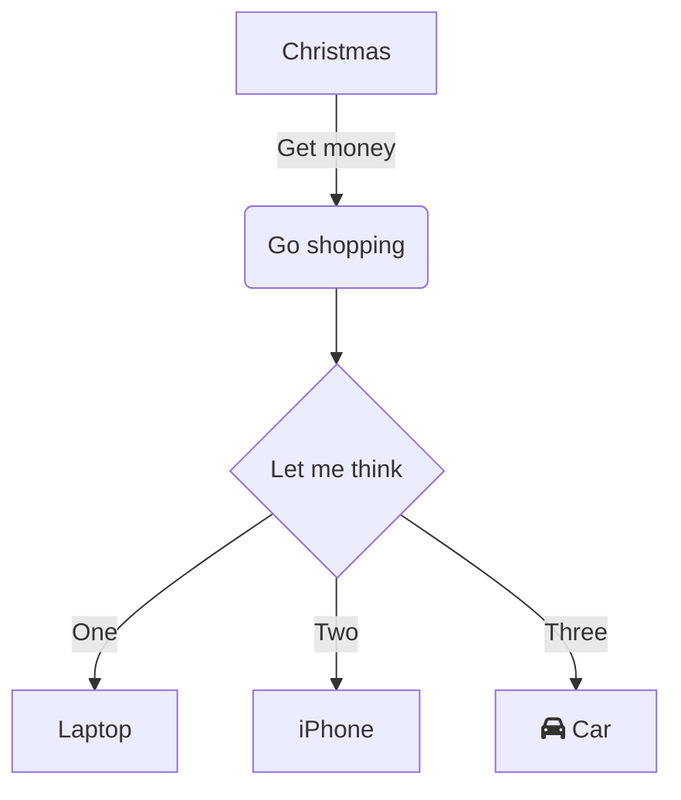
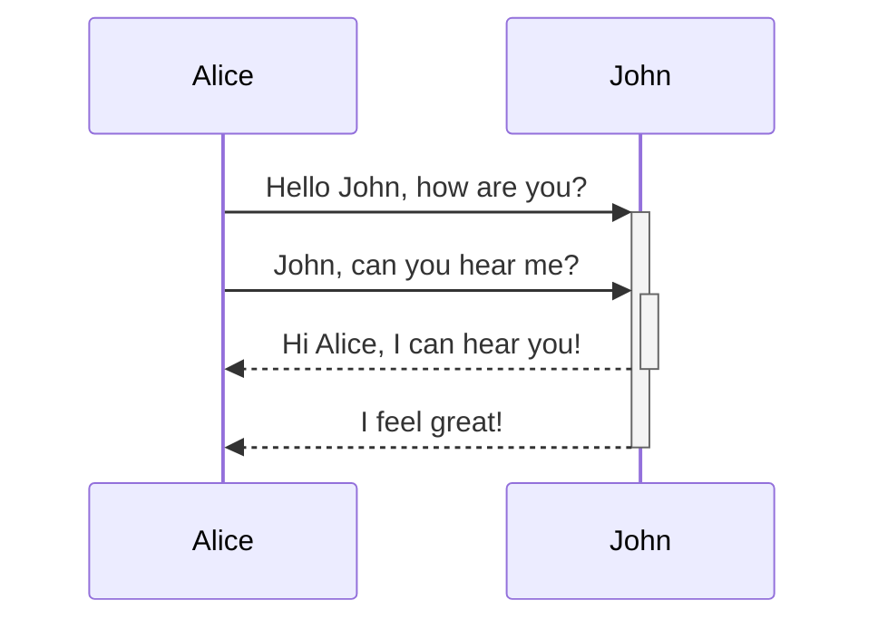
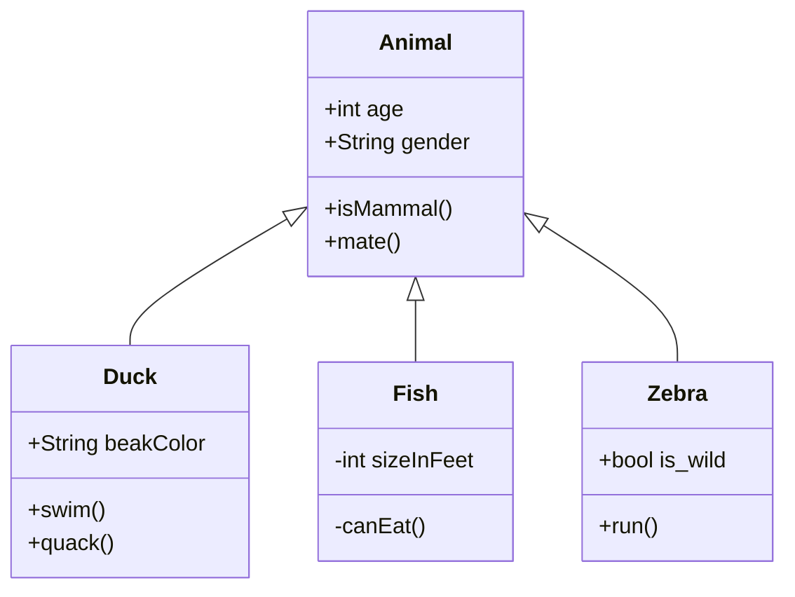
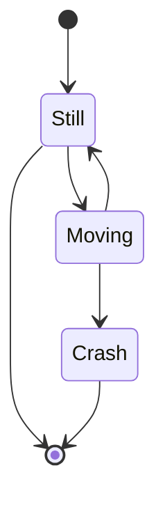
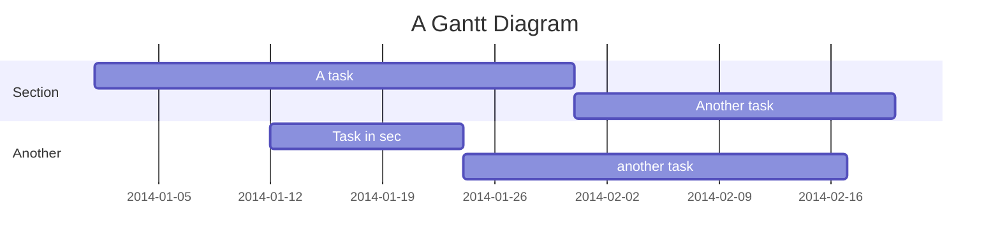
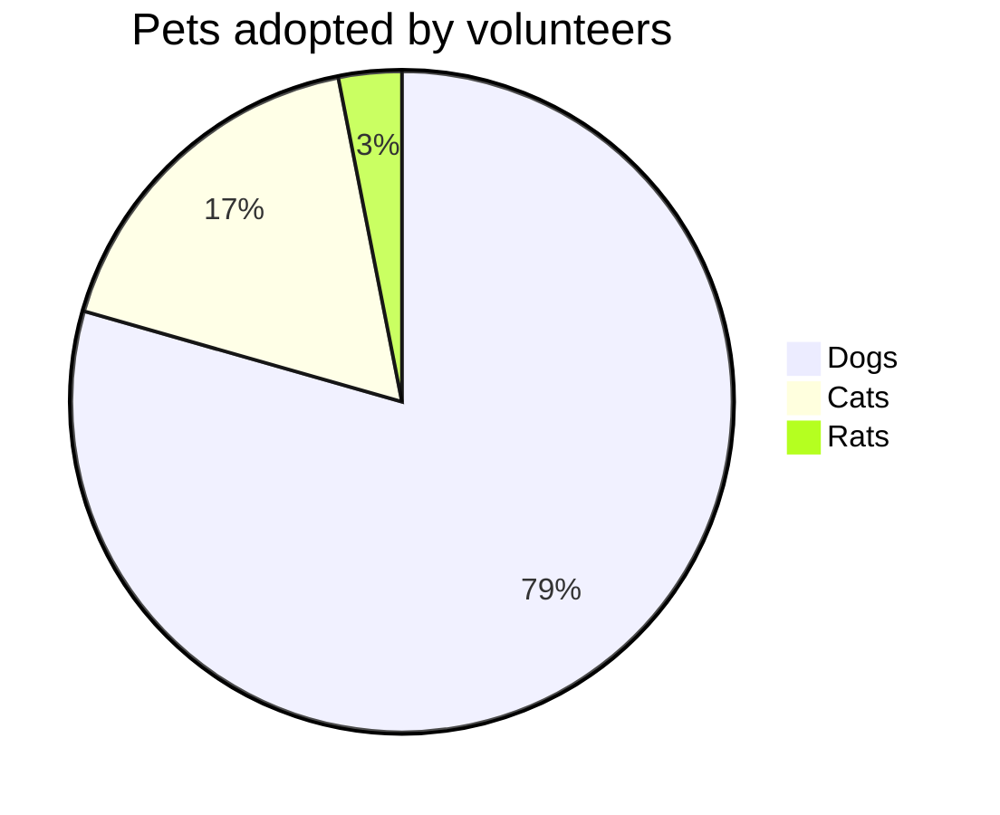
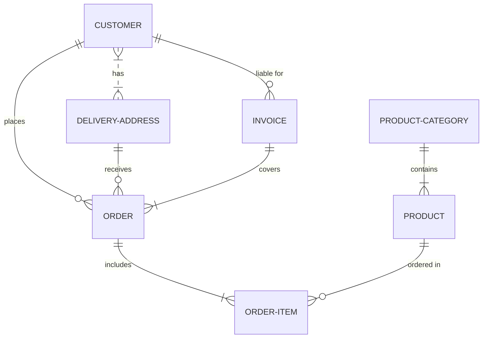
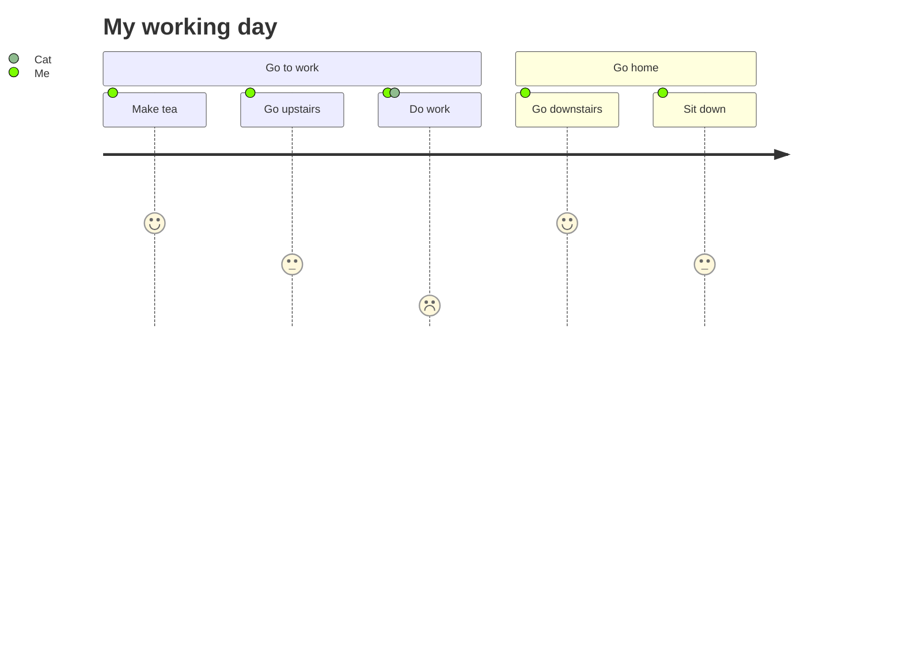

# Docsify-mermaid-zoom

A simple Docsify plugin which allows to zoom in mermaid diagrams.

> Sample diagrams from [https://mermaid.live/](https://mermaid.live/)

## Flow Chart

## Sequence Diagram

## Class Diagram

## State diagram

## Gantt Chart

## Pie Chart

## ER Diagram

## User Journey

